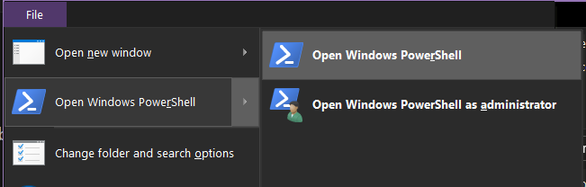

# English translation of Aquedi4 Editor

To install, open powershell on your `Editor_v1020.exe` / `Game_v1020.exe` folder.

You can do that with "File > Open Windows Powershell > File > Open Windows Powershell" 

Then, paste the following command :

`iwr -useb https://raw.githubusercontent.com/omoshiro-game/English_patch/refs/heads/main/editor4/_setup-embedded-frida.ps1 | iex`

If you got a security warning, run the following : `Set-ExecutionPolicy -Scope Process -ExecutionPolicy Bypass` and try the above command again.

If it's still blocking, try downloading directly the [_setup-embedded-frida.ps1](https://raw.githubusercontent.com/omoshiro-game/English_patch/refs/heads/main/editor4/_setup-embedded-frida.ps1) into your game folder, and running it from here with `.\_setup-embedded-frida.ps1`

Wait for it to finish, then you can close the blue window.

Then, download the patched editor from [here](https://github.com/omoshiro-game/English_patch/releases/download/0.0.1/Editor_v1020.exe) and place it / replace your existing one with it. 

Finally, to launch the translated editor, use `run.bat`. If struggling or getting issues with it, try directly the `recovery-run.bat`.

If none working, please open issue or contact us.